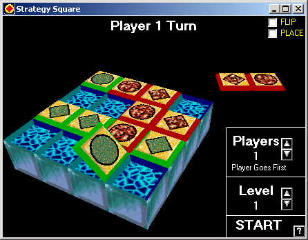



## Magic Strategy Game \(3D DirectX\)

### Description

Based on "Rubik's® Magic Strategy Game" sold by Matchbox™ about 15 years ago.

Each player has tiles with a circle on one side, and a diamond on the other. Each player must place one of their own tiles as well as flip one of their opponents tiles over. The object is to get three like-tiles in a row that can NOT be flipped out of that run by your opponent.

Play against the computer or play against a friend. You can also watch a DEMO of the game by letting the computer play itself! There are 6 levels of difficulty.

The game requires DirectX7, and all objects are 3D and can be rotated on the screen.

Easy to play and lots of fun.

If you like it, and think it's worthy of a vote, then please do so. I would also appreciate any feedback and comments.

-ENJOY!
 
### More Info
 

             |
---                |---
**Submitted On**   |2002-06-05 12:02:16
**By**             |[Dave Andrews](https://github.com/Planet-Source-Code/PSCIndex/blob/master/ByAuthor/dave-andrews.md)
**Level**          |Advanced
**User Rating**    |5.0 (20 globes from 4 users)
**Compatibility**  |VB 5\.0, VB 6\.0
**Category**       |[Games](https://github.com/Planet-Source-Code/PSCIndex/blob/master/ByCategory/games__1-38.md)
**World**          |[Visual Basic](https://github.com/Planet-Source-Code/PSCIndex/blob/master/ByWorld/visual-basic.md)
**Archive File**   |[Magic\_Stra91065662002\.zip](https://github.com/Planet-Source-Code/dave-andrews-magic-strategy-game-3d-directx__1-35545/archive/master.zip)

